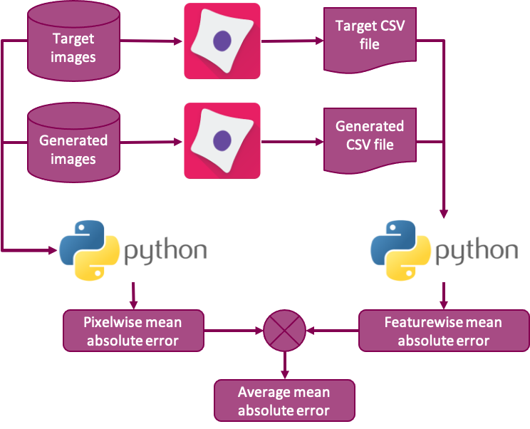

# Adipocyte Cell Challenge

In this repository we provide extensive documentation to facilitate the understanding of the problem, its context and how the hackathon contributions will be evaluated. We furthermore provide the nessessary code to run the evaluation suite used to generate the quantitative evaluation metric used to assess the hackathon contributions. The content and structure of the repo is given by the following 

```sh
.
├── README.md
├── notebooks
│   ├── eda
│   ├── modelling
│   ├── notebook_template.ipynb
│   ├── post_processing
│   │   ├── evaluate_results.ipynb
│   │   └── summarize_results.ipynb
│   ├── pre_processing
│   └── presentation
├── project_local_setup.py
├── scripts
│   ├── run_python_script.sh
│   ├── run_sbatch.sh
│   └── train_model.py
├── src
│   ├── docs
│   ├── misc
│   │   └── examples.py
│   ├── pipeline
│   ├── plotting
│   ├── project_parameters.py
│   └── settings.py
└── tests
    └── test_template.py
```
For more detailed information about the content of each folder, please see the corresponding readme file.

## Cell Profiler Pipe Lines




## Evaluation code


## Documentation


